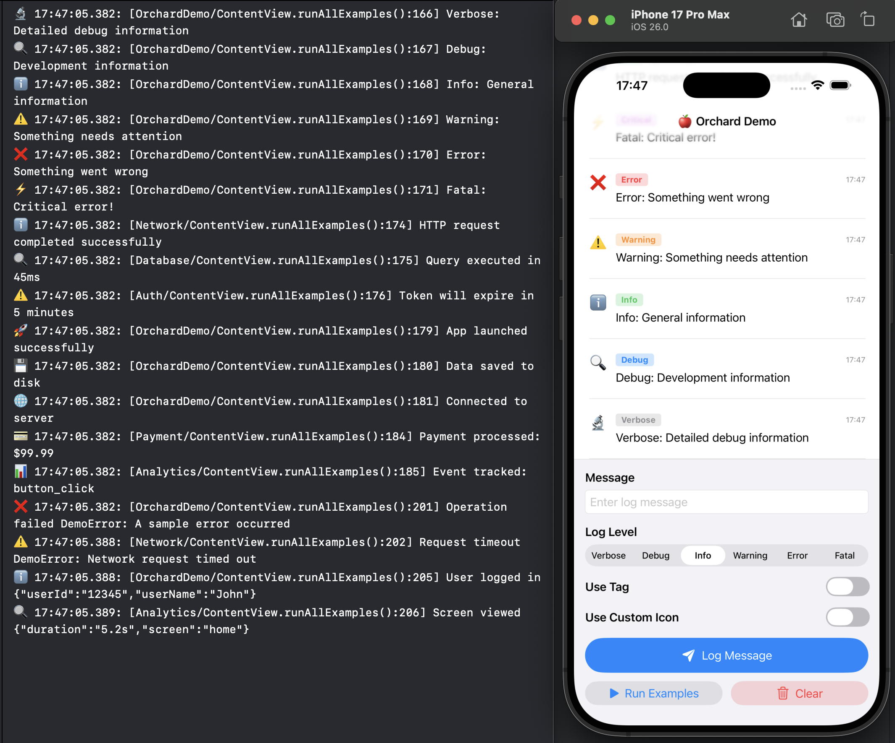

# Orchard for iOS
[](https://github.com/kibotu/Orchard/actions/workflows/build-swift.yml) [](https://github.com/kibotu/Orchard/actions/workflows/ios.yml) [](https://github.com/kibotu/Orchard/releases) 
[](https://support.apple.com/en-us/101566)
[](https://www.swift.org/blog/announcing-swift-6/)

Welcome to **Orchard** - your new best friend for logging on iOS! 🍏📱

Inspired by the clever wordplay behind Timber, the Android logging system (logs and timber, get it?), we decided to bring a slice of that punny brilliance to iOS with Orchard. After all, what's more fitting than logging apples in the world of iPhones?

But let's get serious for a moment. Just because you're developing on iOS doesn't mean your logging has to be... shall we say, subpar? With Orchard, you can elevate your logging game with style and efficiency.

Orchard is a versatile logging system for Swift applications, designed to provide flexible and contextual logging capabilities.

## Table of Contents

- [Key Features](#key-features)
- [📱 Demo App](#-demo-app)
- [Quick Start](#quick-start)
  - [Installation](#installation)
  - [Setup](#setup)
- [Usage Guide](#usage-guide)
  - [1. Automatic Invocation Tracking](#1-automatic-invocation-tracking)
  - [2. Maximum Flexibility](#2-maximum-flexibility)
  - [3. Multiple Loggers](#3-multiple-loggers)
  - [4. Console Logger Configuration](#4-console-logger-configuration)
  - [5. Contextual Logging with Tags & Icons](#5-contextual-logging-with-tags--icons)
  - [6. Rich Error Logging](#6-rich-error-logging)
  - [7. Structured Logging with Arguments](#7-structured-logging-with-arguments)
  - [8. Six Log Levels with Icons](#8-six-log-levels-with-icons)
  - [9. Tags for Organization](#9-tags-for-organization)
  - [10. Custom Icons](#10-custom-icons)
- [Advanced Configuration](#advanced-configuration)
  - [Custom Logger Implementation](#custom-logger-implementation)
- [How to install](#how-to-install)
  - [Swift Package Manager](#swift-package-manager)
- [Requirements](#requirements)
- [License](#license)

## Key Features

- 🎯 **Six Log Levels**: verbose, debug, info, warning, error, and fatal
- 🔌 **Multiple Logging Backends**: Support for custom loggers (Console, File, Remote, etc.)
- 🏷️ **Tags**: Categorize logs by module, feature, or context
- 🎨 **Custom Icons**: Visual indicators for different log types
- 📍 **Automatic Invocation Tracking**: Captures file, function, and line information
- ⏰ **Timestamp Support**: Optional millisecond-precision timestamps
- 🔄 **Flexible Parameters**: Any combination of message, error, and arguments
- 🧵 **Thread-Safe**: Safe for concurrent logging operations

## 📱 Demo App

Want to see Orchard in action? Check out the **iOS Demo App**:

[](docs/screenshot.png)

```bash
cd Examples/OrchardDemo
open OrchardDemo.xcodeproj
```

Press **⌘+R** in Xcode to run the interactive demo with live log display!

[See Examples →](Examples/)

## Quick Start

### Installation

Add the Orchard package to your Swift project via Swift Package Manager.

### Setup

```swift
import Orchard

// Configure console logger with optional features
let consoleLogger = ConsoleLogger()
consoleLogger.showTimesStamp = true    // Show timestamps
consoleLogger.showInvocation = true    // Show file, function, line
Orchard.loggers.append(consoleLogger)
```

## Usage Guide

### 1. Automatic Invocation Tracking

Never wonder where a log came from again. Orchard automatically captures file, function, and line:

```swift
Orchard.i("User logged in")
// Output: ℹ️ 13:54:48.403: [OrchardDemo/ContentView.runAllExamples():168] User logged in
//                           ^ module ^^  ^^ file ^^ ^^^ function ^^^  ^^ line number ^^^^^^ message
```

Toggle invocation details on/off:
```swift
let logger = ConsoleLogger()
logger.showInvocation = true   // Shows full path: /Module/function():line
logger.showInvocation = false  // Shows only module name
```

### 2. Maximum Flexibility

Mix and match any combination of message, error, and arguments:

```swift
// Message only
Orchard.i("App started")

// Error only
Orchard.e(error)

// Message + Error
Orchard.e("Failed to load data", error)

// Message + Arguments
Orchard.i("User action", ["action": "tap", "button": "submit"])

// Error + Arguments
Orchard.e(error, ["context": "startup", "retry": "false"])

// Message + Error + Arguments
Orchard.e("Request failed", error, ["url": "api.example.com", "method": "POST"])

// Everything: tag, icon, message, error, and arguments
Orchard.tag("API").icon("🔥").e("Critical failure", error, ["endpoint": "/users", "status": "500", "retry": "3"])
```

### 3. Multiple Loggers

Log to multiple destinations simultaneously:

```swift
// Send logs to console, file, and remote server at once
Orchard.loggers.append(ConsoleLogger())
Orchard.loggers.append(FileLogger())
Orchard.loggers.append(RemoteLogger())

// Every log call reaches all registered loggers
Orchard.i("User logged in")
// → Appears in console
// → Written to log file
// → Sent to analytics server
```

### 4. Console Logger Configuration

Customize what information appears in your logs:

```swift
let consoleLogger = ConsoleLogger()

// Enable/disable timestamps
consoleLogger.showTimesStamp = true  // Shows: 13:54:48.402:

// Enable/disable invocation details
consoleLogger.showInvocation = true  // Shows: /Filename.function:line

Orchard.loggers.append(consoleLogger)
```

#### Advanced Configuration with ConsoleLoggerConfig

For more control, use `ConsoleLoggerConfig` to customize timestamp format and module name mapping.

**Option 1: Builder-style configuration (recommended)**

```swift
let consoleLogger = ConsoleLogger { config in
    config.showTimestamp = true
    config.timestampFormat = "yyyy-MM-dd HH:mm:ss.SSS"  // Custom date format
    config.showInvocation = true
    config.moduleNameMapper = { moduleName in
        // Custom module name transformation
        // The mapper receives the extracted module name and can transform it
        return moduleName.replacingOccurrences(of: "OrchardDemo", with: "Demo")
    }
}
Orchard.loggers.append(consoleLogger)
```

**Option 2: Config struct initialization**

```swift
let config = ConsoleLoggerConfig(
    showTimestamp: true,
    timestampFormat: "yyyy-MM-dd HH:mm:ss.SSS",  // Custom date format
    showInvocation: true,
    moduleNameMapper: { moduleName in
        // Custom module name transformation
        return moduleName.components(separatedBy: "/").last ?? moduleName
    }
)

let consoleLogger = ConsoleLogger(config: config)
Orchard.loggers.append(consoleLogger)
```

**Option 3: Modify config after initialization**

```swift
let consoleLogger = ConsoleLogger()
consoleLogger.config.timestampFormat = "HH:mm:ss"
consoleLogger.config.moduleNameMapper = { moduleName in
    return "[\(moduleName.uppercased())]"
}
Orchard.loggers.append(consoleLogger)
```

**Configuration Options:**
- `showTimestamp`: Enable/disable timestamps (default: `true`)
- `timestampFormat`: DateFormatter format string (default: `"HH:mm:ss.SSS"`)
- `showInvocation`: Show file/function/line details (default: `true`)
- `moduleNameMapper`: Transform module names with a custom closure (default: `nil`)
  - The closure receives the extracted module name from `fileId.moduleNameFromFile`
  - Return the transformed module name to display in logs

**Example with custom module name mapper:**
```swift
// Shorten module names: "MyApp/ViewModels/UserViewModel" → "UserViewModel"
let logger = ConsoleLogger { config in
    config.moduleNameMapper = { moduleName in
        return moduleName.components(separatedBy: "/").last ?? moduleName
    }
}
Orchard.loggers.append(logger)

Orchard.i("User logged in")
// Output: ℹ️ 13:54:48.403: [UserViewModel/login:42] User logged in
```

### 5. Contextual Logging with Tags & Icons

The killer feature: combine tags and custom icons for instantly recognizable, categorized logs:

```swift
// Payment processing
Orchard.tag("Payment").icon("💳").i("Payment processed: $99.99")
// Output: 💳 13:54:48.403: [Payment/ContentView.runAllExamples():184] Payment processed: $99.99

// Analytics tracking
Orchard.tag("Analytics").icon("📊").d("Event tracked: button_click")
// Output: 📊 13:54:48.403: [Analytics/ContentView.runAllExamples():185] Event tracked: button_click

// Network monitoring
Orchard.tag("Network").icon("🌐").i("Connected to server")
// Output: 🌐 13:54:48.403: [Network/ContentView.runAllExamples():181] Connected to server
```

### 6. Rich Error Logging

Log errors with full context - message, error object, and metadata in one call:

```swift
enum NetworkError: Error, CustomStringConvertible {
    case timeout
    case connectionFailed(reason: String)
    
    var description: String {
        switch self {
        case .timeout:
            return "NetworkError: Request timed out"
        case .connectionFailed(let reason):
            return "NetworkError: Connection failed - \(reason)"
        }
    }
}

// Message with error
Orchard.e("Operation failed", NetworkError.connectionFailed(reason: "Host unreachable"))
// Output: ❌ 13:54:48.403: [OrchardDemo/ContentView.runAllExamples():201] Operation failed NetworkError: Connection failed - Host unreachable

// Full context: tag, icon, message, and error
Orchard.tag("Network").icon("⚠️").e("Request timeout", NetworkError.timeout)
// Output: ⚠️ 13:54:48.413: [Network/ContentView.runAllExamples():202] Request timeout NetworkError: Request timed out

// Add metadata for debugging
Orchard.tag("API").icon("🔥").e("Request failed", NetworkError.timeout, ["endpoint": "/users", "retry": "3"])
// Output: 🔥 13:54:48.413: [API/ContentView.runAllExamples():203] Request failed NetworkError: Request timed out {"endpoint":"/users","retry":"3"}
```

### 7. Structured Logging with Arguments

Attach key-value pairs for rich, queryable logs - perfect for analytics and debugging:

```swift
// User events
Orchard.i("User logged in", ["userId": "12345", "userName": "John", "method": "oauth"])
// Output: ℹ️ 13:54:48.413: [OrchardDemo/ContentView.runAllExamples():205] User logged in {"userId":"12345","userName":"John","method":"oauth"}

// Performance metrics
Orchard.tag("Performance").d("API response", ["duration": "245ms", "endpoint": "/api/users", "status": "200"])
// Output: 🔍 13:54:48.413: [Performance/ContentView.runAllExamples():206] API response {"duration":"245ms","endpoint":"/api/users","status":"200"}

// Error context
Orchard.tag("Database").e("Query failed", error, ["query": "SELECT * FROM users", "retry": "false"])
```

### 8. Six Log Levels with Icons

Professional logging with built-in visual hierarchy:

```swift
Orchard.v("Verbose: Detailed debug information")
// Output: 🔬 13:54:48.402: [OrchardDemo/ContentView.runAllExamples():166] Verbose: Detailed debug information

Orchard.d("Debug: Development information")
// Output: 🔍 13:54:48.403: [OrchardDemo/ContentView.runAllExamples():167] Debug: Development information

Orchard.i("Info: General information")
// Output: ℹ️ 13:54:48.403: [OrchardDemo/ContentView.runAllExamples():168] Info: General information

Orchard.w("Warning: Something needs attention")
// Output: ⚠️ 13:54:48.403: [OrchardDemo/ContentView.runAllExamples():169] Warning: Something needs attention

Orchard.e("Error: Something went wrong")
// Output: ❌ 13:54:48.403: [OrchardDemo/ContentView.runAllExamples():170] Error: Something went wrong

Orchard.f("Fatal: Critical error!")
// Output: ⚡️ 13:54:48.403: [OrchardDemo/ContentView.runAllExamples():171] Fatal: Critical error!
```

### 9. Tags for Organization

Categorize logs by module, feature, or any context you need:

```swift
// Network operations
Orchard.tag("Network").i("HTTP request completed successfully")
// Output: ℹ️ 13:54:48.403: [Network/ContentView.runAllExamples():174] HTTP request completed successfully

// Database operations
Orchard.tag("Database").d("Query executed in 45ms")
// Output: 🔍 13:54:48.403: [Database/ContentView.runAllExamples():175] Query executed in 45ms

// Authentication
Orchard.tag("Auth").w("Token will expire in 5 minutes")
// Output: ⚠️ 13:54:48.403: [Auth/ContentView.runAllExamples():176] Token will expire in 5 minutes
```

### 10. Custom Icons

Override default level icons for visual categorization:

```swift
Orchard.icon("🚀").i("App launched successfully")
// Output: 🚀 13:54:48.403: [OrchardDemo/ContentView.runAllExamples():179] App launched successfully

Orchard.icon("💾").d("Data saved to disk")
// Output: 💾 13:54:48.403: [OrchardDemo/ContentView.runAllExamples():180] Data saved to disk

Orchard.icon("🔐").w("Certificate will expire soon")
// Output: 🔐 13:54:48.403: [OrchardDemo/ContentView.runAllExamples():181] Certificate will expire soon
```

## Advanced Configuration

### Custom Logger Implementation

Create your own logger by implementing the `Orchard.Logger` protocol:

```swift
class FileLogger: Orchard.Logger {
    let level: Orchard.Level = .info
    var tag: String?
    var icon: Character?
    
    func info(_ message: String?, _ error: Error?, _ args: [String: CustomStringConvertible]?, 
              _ file: String, _ fileId: String, _ function: String, _ line: Int) {
        // Write to file...
        let logEntry = "\(Date()): [\(tag ?? "App")] \(message ?? "")"
        // Append to file
    }
    
    // Implement other level methods (verbose, debug, warning, error, fatal)...
}

Orchard.loggers.append(FileLogger())
```

## How to install

### Swift Package Manager

<table>
<tr>
<td width="120px"><b>Latest Version</b></td>
<td><a href="https://github.com/kibotu/Orchard/releases"></a></td>
</tr>
</table>

Add the dependency to your `Package.swift`:

```swift
dependencies: [
    .package(url: "https://github.com/kibotu/Orchard", from: "1.0.0"),
],
targets: [
    .target(
        name: "YourTarget",
        dependencies: ["Orchard"]
    )
]
```

Or add it directly in Xcode:
1. **File → Add Package Dependencies**
2. Enter: `https://github.com/kibotu/Orchard`
3. Select the latest version shown above

## Requirements

- iOS 15.0 or later
- Xcode 16.0 or later

Contributions welcome!

### License
<pre>
Copyright 2024 Jan Rabe & CHECK24

Licensed under the Apache License, Version 2.0 (the "License");
you may not use this file except in compliance with the License.
You may obtain a copy of the License at

   http://www.apache.org/licenses/LICENSE-2.0

Unless required by applicable law or agreed to in writing, software
distributed under the License is distributed on an "AS IS" BASIS,
WITHOUT WARRANTIES OR CONDITIONS OF ANY KIND, either express or implied.
See the License for the specific language governing permissions and
limitations under the License.
</pre>
